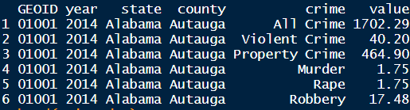
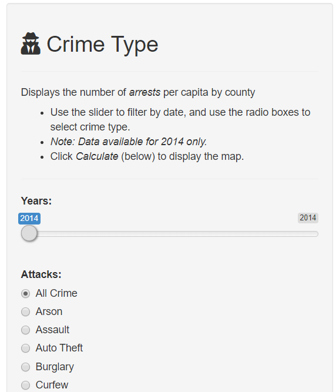
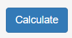
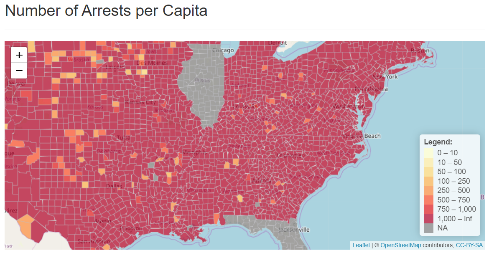

```{r setup, include=FALSE}
knitr::opts_chunk$set(echo = FALSE)
```

##  Introduction

This presentation is part of the Course Project for the Coursera Developing Data Products class.

The assignment has a few requirements:

1.  Create a Shiny application and deploy.
2.  Prepare a presentation about the application and publish to Rpubs.
3.  Upload the R code used to create the application to GitHub.

This presentation resolves the second requirement.

The links to the Shiny app created to address the primary requirement, along with the R code, are available on the next slide. 

##  Links

The Shiny app is available here:  <https://dbrad4d.shinyapps.io/dp_wk4_assign_bradford/>.

Source code for ui.R and server.R files, along with this presentation, are available on GitHub: {Instert Link}

##  This app helps the user... 

This app allows the user to view crime data for each county in the USA to help in the decision-making process to either relocate or visit that area.  It can also help companies understand if the environment is safe for employees as they map out their facilities strategy.

More details around the source data for this app along with how to use the app are on the next two slides.  Here is a snapshot of the core data elements:

{ width=50% }

Note that the [value] element represents the crime rate, per capita, for that county and crime type.  For example, for every 1,000 residents in Autauga, Alabama there were 1.75 murders in 2014.

##  How to use:

This app is very intuitive.  Once launched, you will select the crime type you want to assess, scroll to the bottom, click the "Calculate" button, and then navigate the interactive map to the geographical region you wish to view.  Just hover your mouse over the county you're interested in and the values will pop up.  There is a color-coded legend available to easily see trends and hot spotes.

{ width=10% }

{ width=5% }

{ width=20% }


##  Notes  

Data Sources:

Crime data collected from FBI and Dept of Justice sources for 2014 only.  Note that data was not available for the following US states: FL, IL, portions of NYC.

Crime data: https://www.openicpsr.org/openicpsr/project/108164/version/V3/view
Map data: https://www.census.gov/geo/maps-data/data/cbf/cbf_counties.html

Also be cautious about county-level data.  Refer to the following [link.](https://www.openicpsr.org/openicpsr/project/108164/version/V3/view?path=/openicpsr/108164/fcr:versions/V3/Maltz---Targonski-2002-A-Note-on-the-Use-of-County-Level-UCR-Data.pdf&type=file#)

